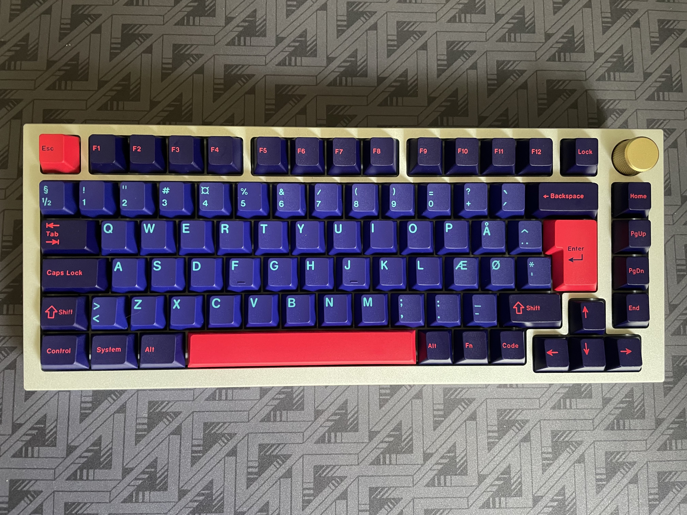
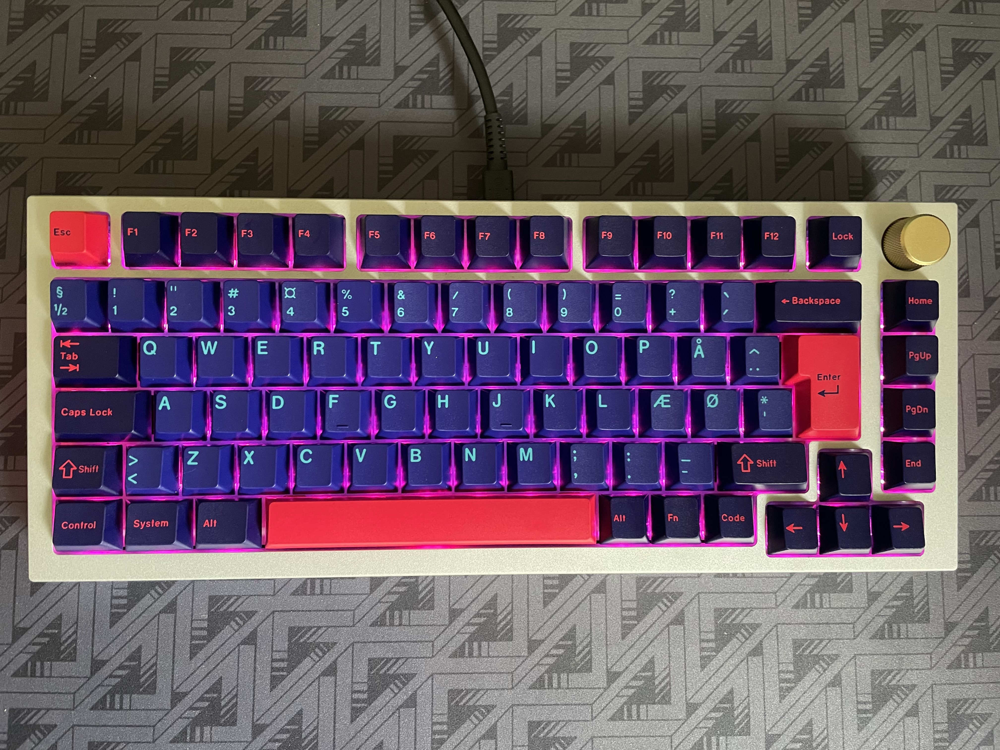

# liddqd's gmmk pro config

- continued experimentation with debounce 5ms -> 10ms -> 16ms
	- moved config from keyboards/gmmk/pro/config.h to keymap/config.h
	- using *asym_eager_defer_pk* mixed algo in rules.mk, instead of default *sym_defer_pk*
- capslock indicators, set edit + modifier keys to red
- fn/mo(1) turn off alphas, set hotkeys to cyan
- bootloader/RESET = fn/mo(1)+b
	- bootloader/RESET set all rgb to red
- clear eeprom esc on boot

# gmmk board assembled as of 2021/11

# gmmk board assembled as of 2021/10

# pictures of pcb

