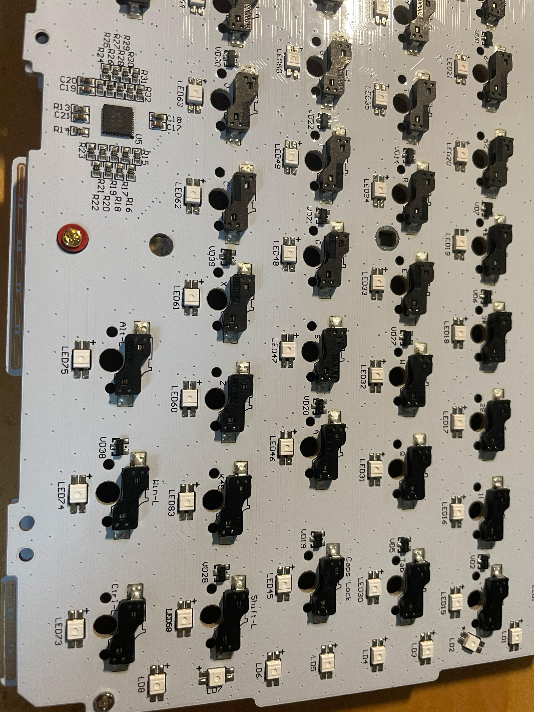

# liddqd's gmmk pro config

- ~~set debounce to 16ms as default on stock firmware to eliminate double input especially [SPACE]~~ is set back to 5ms. Switches were mostlikely the cause.
	- set in keyboards/gmmk/pro/config.h
- capslock indicators, set edit + modifier keys to red
- fn/mo(1) turn off alphas, set hotkeys to cyan
- bootloader/RESET = fn/mo(1)+b
	- bootloader/RESET set all rgb to red
- clear eeprom esc on boot

# gmmk board assembled as of 2021/10

# pictures of pcb

